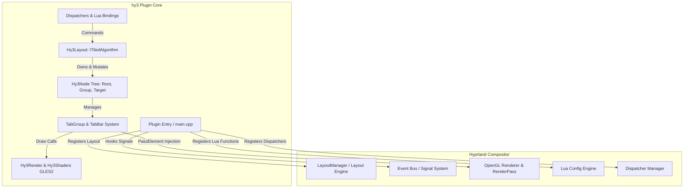
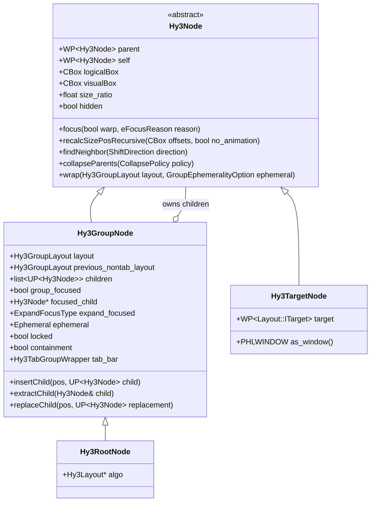
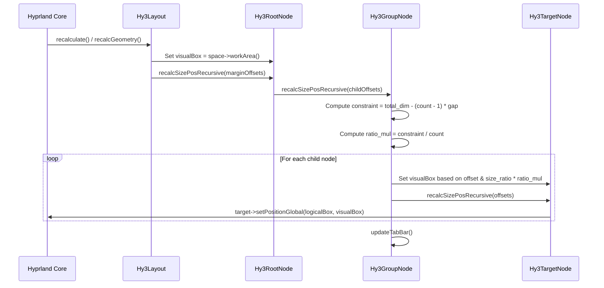
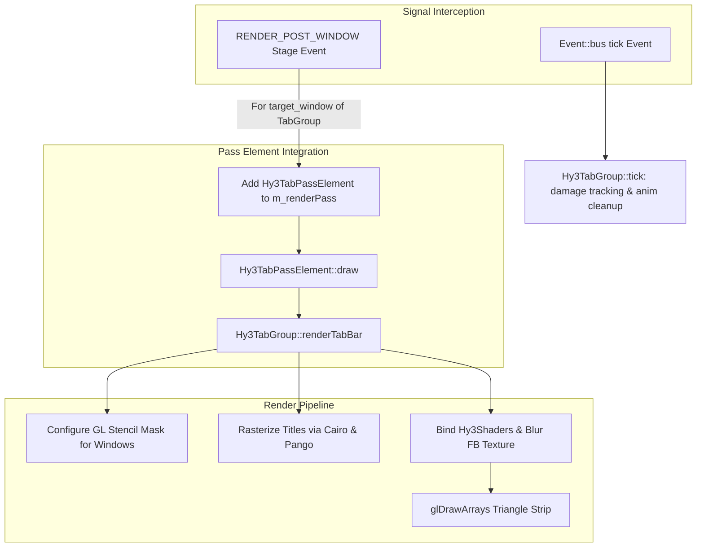

# hy3 Architecture

## 1. Overview & Architectural Philosophy

**hy3** is an i3/sway-inspired manual tiling engine plugin for [Hyprland](https://github.com/hyprwm/hyprland), implemented in C++23. Unlike Hyprland's built-in automatic tiling layouts (`dwindle` and `master`), hy3 implements a **hierarchical tree-based layout model**. In this model, workspaces consist of an explicit, mutable tree of split containers and tabbed groups.

### Core Architectural Principles

1. **Explicit Tree Hierarchy**: Every window is a leaf target node housed within one or more nested group containers (`SplitH`, `SplitV`, `Tabbed`). Container structure is deliberate and directly manipulated by the user or autotiling rules.
2. **Separation of Geometry and Logical Relationships**: Nodes maintain `logicalBox` (bounding region including reserved margins and gaps) and `visualBox` (actual rendered frame). Resizing adjusts normalized `size_ratio` values among siblings rather than absolute pixel coordinates.
3. **Container-Level Actions**: Operations such as focus, movement, closing (`killactive`), and workspace migration operate on entire subtrees via dedicated actor resolution (`getPlacementActor()`, `getExpandActor()`).
4. **First-Class Tabbed Containers**: Tab groups are deeply integrated into Hyprland's rendering pipeline. Tabs feature custom OpenGL ES shaders, background blur extraction, Cairo/Pango font rasterization, and OkLab-space color interpolations.
5. **Decoupled Event-Driven Synchronization**: The layout engine observes compositor events via Hyprland's `Event::bus()` signals (`window.active`, `window.title`, `window.urgent`, `render.stage`, `tick`, and pointer button events) to trigger layout recalculations and animation steps.

---

## 2. High-Level Architecture



### Module Breakdown

| Module / Source File | Responsibility |
| :--- | :--- |
| [`src/main.cpp`](file:///home/omer/hy3/src/main.cpp) | Plugin initialization (`PLUGIN_INIT`), configuration definitions, event bus listener setup, and layout algorithm factory registration. |
| [`src/Hy3Layout.hpp`](file:///home/omer/hy3/src/Hy3Layout.hpp) / [`.cpp`](file:///home/omer/hy3/src/Hy3Layout.cpp) | Core layout algorithm deriving from `Layout::ITiledAlgorithm`. Handles target lifecycle, geometry recalculation, focus shifts, cross-monitor/cross-workspace movements, and autotiling. |
| [`src/Hy3Node.hpp`](file:///home/omer/hy3/src/Hy3Node.hpp) / [`.cpp`](file:///home/omer/hy3/src/Hy3Node.cpp) | Node hierarchy definitions (`Hy3Node`, `Hy3RootNode`, `Hy3GroupNode`, `Hy3TargetNode`). Implements tree navigation, child extraction/insertion, node wrapping, sibling search, and tree collapse policies. |
| [`src/TabGroup.hpp`](file:///home/omer/hy3/src/TabGroup.hpp) / [`.cpp`](file:///home/omer/hy3/src/TabGroup.cpp) | Manages tabbed groups, tab bars, per-tab animated states (`Hy3TabBarEntry`), stencil masking for overlapping windows, damage tracking, and Cairo/Pango text rasterization. |
| [`src/render.hpp`](file:///home/omer/hy3/src/render.hpp) / [`.cpp`](file:///home/omer/hy3/src/render.cpp) | OpenGL ES rendering routines for drawing rounded tab bar rectangles with borders, smooth corner antialiasing, and background blur sampling. |
| [`src/shaders.hpp`](file:///home/omer/hy3/src/shaders.hpp) / [`.cpp`](file:///home/omer/hy3/src/shaders.cpp) | Compiles and links the tab bar vertex (`tab.vert`) and fragment (`tab.frag`) shaders; manages GL uniform locations. |
| [`src/dispatchers.hpp`](file:///home/omer/hy3/src/dispatchers.hpp) / [`.cpp`](file:///home/omer/hy3/src/dispatchers.cpp) | Parser and bridge for standard Hyprland dispatchers (`hy3:*`) and native Lua binding functions (`hl.plugin.hy3.*`). |
| [`src/globals.hpp`](file:///home/omer/hy3/src/globals.hpp) | Shared global state (`g_hy3Instances`, `g_tabGroups`, `g_destroyingTabGroups`, `g_suppressInsert`, signal listener handles). |
| [`src/log.hpp`](file:///home/omer/hy3/src/log.hpp) | Formatting wrappers around Hyprutils logger (`hy3_log`). |

---

## 3. Node Hierarchy & Tree Structure

Every managed workspace corresponds to a `Hy3Layout` instance owning a single `Hy3RootNode`. The node tree forms a strictly typed hierarchy:



### 1. Node Types
- [`Hy3TargetNode`](file:///home/omer/hy3/src/Hy3Node.hpp#L126-L128): Represents an actual window target managed by Hyprland's layout engine (`Layout::ITarget`). Holds a weak pointer to the target and provides access to `PHLWINDOW`.
- [`Hy3GroupNode`](file:///home/omer/hy3/src/Hy3Node.hpp#L130-L162): An intermediate container organizing child nodes according to a `Hy3GroupLayout`:
  - `SplitH`: Horizontal tiling (children laid out side-by-side along the X-axis).
  - `SplitV`: Vertical tiling (children stacked top-to-bottom along the Y-axis).
  - `Tabbed`: All children share the same bounding area below a rendered tab bar; only the currently focused child is visible.
  - `Root`: Fixed root container layout representing the workspace work area.
- [`Hy3RootNode`](file:///home/omer/hy3/src/Hy3Node.hpp#L164-L167): Root of the workspace layout tree. Directly references the owning `Hy3Layout`.

### 2. Node Navigation and Actor Resolution
hy3 features specialized methods for traversing hierarchy layers:
- **`getFocusedNode(ignore_group_focus, stop_at_expanded)`**: Recursively descends from any node or root following `focused_child` to retrieve the currently focused leaf window or container.
- **`getExpandActor()`**: Searches up the ancestral tree to find the outermost container involved in an active latch expansion.
- **`getPlacementActor()`**: Used when inserting new windows or grouping. Ascends beyond latch-expanded containers and skips locked tab groups (`group.locked == true`), ensuring new splits wrap the intended container boundary.

---

## 4. Layout Calculation & Geometry Recalculation

Recalculating geometry in hy3 is handled recursively via [`Hy3Node::recalcSizePosRecursive`](file:///home/omer/hy3/src/Hy3Node.cpp#L328-L489).



### Calculation Steps

1. **Workspace Boundary & Gap Retrieval**:
   - The root's bounds are set to `space->workArea()` ([`Hy3Layout.cpp:L438`](file:///home/omer/hy3/src/Hy3Layout.cpp#L438)).
   - Inner gaps (`gaps_in`) are resolved dynamically from workspace rules (`Config::workspaceRuleMgr()`), falling back to `general:gaps_in`.
2. **Split Constraint Computation**:
   - For `SplitH`:
     $$\text{constraint} = \text{width} - (\text{child\_count} - 1) \times (\text{gaps\_in.left} + \text{gaps\_in.right})$$
   - For `SplitV`:
     $$\text{constraint} = \text{height} - (\text{child\_count} - 1) \times (\text{gaps\_in.top} + \text{gaps\_in.bottom})$$
   - Base multiplier: $\text{ratio\_mul} = \frac{\text{constraint}}{\text{child\_count}}$.
   - Child size: $\text{child\_dim} = \text{child.size\_ratio} \times \text{ratio\_mul} - \text{inset}$.
3. **Single Window Group Inset**:
   - If a non-root group contains only a single window, an inset of `plugin:hy3:group_inset` is subtracted from the outer edge to visually distinguish single-window groups.
4. **Tab Group Geometry**:
   - In tabbed groups, the active tab bar height (`tabs:height`) and padding (`tabs:padding`) create a vertical offset for children:
     $$\text{tab\_offset} = \text{tab\_height} + \text{tab\_padding}$$
   - Only `focused_child` has `hidden = false`. Unfocused children in a tab group have `hidden = true` and are warped out of active display.
5. **Latch Expansion (Zoom/Maximize-Within-Tree)**:
   - When a group has `expand_focused == ExpandFocusType::Latch`, the focused child is rendered across the entire bounds of the group container, while siblings are hidden.

---

## 5. Tree Mutation & Collapse Engine

Dynamic tree management is critical for a smooth user experience. When windows open, close, or move, containers may become redundant.

### Collapse Policies (`CollapsePolicy`)
The behavior is governed by `plugin:hy3:node_collapse_policy` ([`Hy3Layout.cpp:L41-L50`](file:///home/omer/hy3/src/Hy3Layout.cpp#L41-L50)):
- **`0` (`CollapsePolicy::SingleNodeGroups`)**: Collapses any container holding only a single child, splicing the child directly into the parent.
- **`1` (`CollapsePolicy::InvalidOnly`)**: Keeps nested groups intact, collapsing only empty containers.
- **`2` (`CollapsePolicy::EmptySplits`, Default)**: Automatically removes single-child split containers (`SplitH`, `SplitV`), but preserves single-child tab groups unless their parent is also a tab group or marked ephemeral.

### Tree Mutation Primitives

- **`wrap(layout, ephemeral, change)`** ([`Hy3Node.cpp:L814`](file:///home/omer/hy3/src/Hy3Node.cpp#L814)):
  Replaces a node in its parent's child list with a newly created `Hy3GroupNode`, then inserts the original node as the child of this new group. If the parent is already a single-child container and `change == true`, it modifies the parent's layout in-place without creating a redundant container.
- **`extractAndMerge(child, out_parent, policy)`** ([`Hy3Node.cpp:L769`](file:///home/omer/hy3/src/Hy3Node.cpp#L769)):
  Extracts a child node from its parent group, redistributes its `size_ratio` proportionally across remaining siblings, and invokes `collapseParents(policy)` on the remaining hierarchy.
- **`insertAndMerge(pos, child, policy)`** ([`Hy3Node.cpp:L800`](file:///home/omer/hy3/src/Hy3Node.cpp#L800)):
  Inserts a node at iterator position `pos` and checks collapse rules.
- **Ephemeral Groups**:
  Containers created with `GroupEphemeralityOption::Ephemeral` or `ForceEphemeral` transition between `Ephemeral::Staged` (waiting for additional windows) and `Ephemeral::Active`. When an active ephemeral container drops back to 1 child, `shouldCollapseNode` automatically collapses it.

---

## 6. Tab System & Custom Rendering Pipeline

hy3 features a custom rendering pipeline for tabbed containers that integrates directly with Hyprland's render pass engine.



### 1. In-Pass Rendering (`Hy3TabPassElement`)
Rather than drawing tabs after all windows finish rendering, hy3 listens to `Event::bus()->m_events.render.stage`:
- On `RENDER_PRE_WINDOWS`, it clears the list of rendered groups.
- On `RENDER_POST_WINDOW`, when Hyprland finishes rendering a window that matches `tab_group->target_window`, a `Hy3TabPassElement` is appended to `g_pHyprRenderer->m_renderPass`.
- This ensures tab bars respect compositor z-ordering, window stack layers, and workspace transition animations (e.g. `slidevert`, `fade`).

### 2. Tab Bar Graphics & Shader Architecture
The tab bar is drawn via OpenGL ES 2.0 with custom shaders:
- **`src/tab.vert`**: Maps normalized vertex coordinates (`pos`) into screen-space pixel coordinates and projects them into monitor texture coordinates (`monitorTexCoord`).
- **`src/tab.frag`**:
  - Computes Signed Distance Field (SDF) box boundaries: `cornerDist = min(pixCoord, pixelSize - pixCoord)`.
  - Applies a smoothing constant ($\approx 0.58758$) and `smoothstep` for hardware-antialiased rounded corners (`outerRadius`).
  - Evaluates inner radius (`outerRadius - borderWidth`) to draw sharp, antialiased borders.
  - Samples the compositor's blur framebuffer (`m_blurFB->getTexture()`) when `plugin:hy3:tabs:blur` is enabled and fill opacity is $< 1.0$.

### 3. OkLab Color Space Interpolation
Color blending between tab states is handled in the perceptual **OkLab** color space via [`merge_colors`](file:///home/omer/hy3/src/TabGroup.cpp#L38-L54):
- Blends between six distinct states:
  1. `Active`: Selected tab in the currently active container on the focused monitor.
  2. `Active Alt Monitor`: Selected tab on an unfocused monitor.
  3. `Focused`: Selected tab inside an unfocused group container.
  4. `Urgent`: Window flagged with `m_isUrgent`.
  5. `Locked`: Container locked via `hy3:locktab`.
  6. `Inactive`: Unselected tab.
- Interpolation weights follow animated float variables (`PHLANIMVAR<float>` with `fadeSwitch`).

### 4. Typography Pipeline
Window titles are rasterized onto an offscreen Cairo surface backed by Pango (`pango_cairo_*`):
- Features caching: Text texture is regenerated only if title, font, font size, scale, or layout width changes ([`TabGroup.cpp:L264-L276`](file:///home/omer/hy3/src/TabGroup.cpp#L264-L276)).
- Truncation with trailing ellipsis (`PANGO_ELLIPSIZE_END`) when the title exceeds tab segment width.
- Uploaded to GPU as an `ITexture` and rendered with `glBlendFunc(GL_CONSTANT_COLOR, GL_ONE_MINUS_SRC_ALPHA)`.

---

## 7. Dispatcher & IPC Layer

hy3 provides two dispatcher interfaces:
1. **Hyprland Dispatchers (`hy3:*`)**: String-based command dispatchers registered via `HyprlandAPI::addDispatcherV2`.
2. **Lua API (`hl.plugin.hy3.*`)**: Factory functions registered via `HyprlandAPI::addLuaFunction` for users writing configuration in Lua.

```mermaid
graph LR
    subgraph Dispatcher Inputs
        CONF_KEY[Hyprland Keybind: hy3:makegroup, v]
        LUA_CALL[Lua Config: hl.plugin.hy3.make_group('v')]
    end

    subgraph Dispatcher Handlers
        DISP_FN[dispatch_makegroup]
        LUA_FN[luaMakeGroup]
    end

    subgraph Internal Action
        MAKE_GRP[makeGroup / SMakeGroupAction]
        HY3_ACT[Hy3Layout::makeGroupOnWorkspace]
    end

    CONF_KEY --> DISP_FN
    LUA_CALL --> LUA_FN
    DISP_FN --> MAKE_GRP
    LUA_FN --> MAKE_GRP
    MAKE_GRP --> HY3_ACT
```

### Key Dispatcher Subsystems

- **Movement & Focus (`movefocus`, `movewindow`)**:
  - Resolves spatial coordinates and traverses the tree hierarchy across matching split orientations using [`shiftOrGetFocus`](file:///home/omer/hy3/src/Hy3Layout.cpp#L1477-L1668).
  - Handles container boundaries: can break out of containers or descend into neighboring subtrees.
  - **Focus Navigation (`movefocus`)**: Automatically bridges across physical monitors if movement leaves the workspace boundary via [`focusMonitor`](file:///home/omer/hy3/src/Hy3Layout.cpp#L831-L866).
  - **Window Shifting (`movewindow`)**: Supports seamless cross-monitor movement via [`shiftMonitor`](file:///home/omer/hy3/src/Hy3Layout.cpp#L977-L1045) and [`insertNodeAtEdge`](file:///home/omer/hy3/src/Hy3Layout.cpp#L390-L474). When a window/container is shifted past the root boundary, it extracts cleanly from the source tree, reassigns window layout targets to the destination space, and docks at the inverted edge of the target monitor (e.g. moving Right enters on the Left edge). If no monitor is present, it falls back to wrapping into a local split. Can be controlled globally via `plugin:hy3:move_window_cross_monitor` or per command.
- **Workspace Transfer (`movetoworkspace`)**:
  - Safely extracts the entire subtree, assigns underlying windows to the target workspace space (`assignToSpace`), and inserts the subtree into the destination `Hy3Layout` instance.
  - Interoperates with third-party plugins like `hyprsplit` via dynamic symbol lookup (`dlsym`).
- **Autotiling Integration**:
  - When enabled, window insertions evaluate dimensions against `trigger_width` and `trigger_height`.
  - When thresholds are crossed, hy3 wraps the insertion point in an ephemeral split oriented opposite to the parent group.

---

## 8. Build System & Packaging

- **CMake**: `CMakeLists.txt` builds `libhy3.so` with `-std=c++23`, links against `hyprland`, `pixman-1`, `libdrm`, `pango`, `pangocairo`, `libinput`, and embeds GLSL shaders via `shader_content.hpp.in`.
- **Nix Flakes**: `flake.nix` and `default.nix` provide hermetic builds pinned to specific Hyprland git revisions.
- **hyprpm**: `hyprpm.toml` provides explicit commit pins matching upstream Hyprland release tags (from `hl0.40.0` up to `hl0.56.x`).
